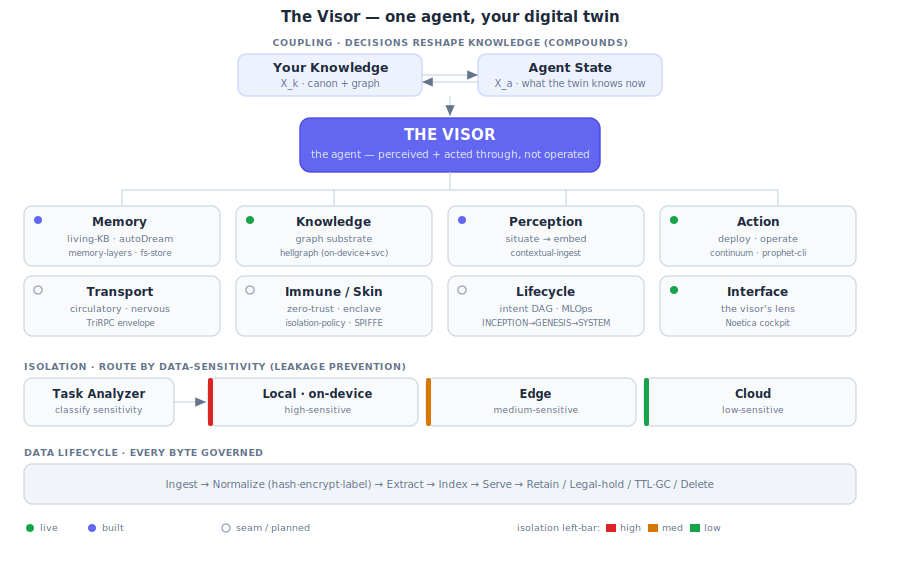

# The Visor — the agent as your digital twin

> **North star.** The Noetica agent is not a tool you operate; it is **your digital twin — a "visor"**
> you perceive and act *through*. Everything below is one organism serving one loop.

## The coupling (why it's a *twin*, not a chatbot)

Your knowledge (`X_k`) and the agent's state (`X_a`) are **coupled**: they reshape each other, and every
decision **compounds** back into what the twin knows. That feedback loop — not the model — is what makes
it a twin. (Coupled-DNN pattern: knowledge encoding ⟷ agent-state encoding via a bidirectional interface,
graph propagation with temporal decay, decisions reshaping knowledge flow.)

## Organs → concrete modules

| Organ | Body role | Module | Status |
| --- | --- | --- | --- |
| **Memory** | hippocampus | `agent-machine/lib/memory-layers.ts` + `fs-memory-store.ts` (Claude-pattern layered memory, living-KB, 5-phase autoDream) | built |
| **Knowledge** | cortex | `hellgraph` (on-device + as-a-service) via `/api/graph/*` | live |
| **Perception** | senses | `agent-machine/lib/contextual-ingest.ts` (situate → embed) + the data lifecycle | built |
| **Action** | muscles | `sourceos-continuum` / Porter deploy + `prophet-cli` operator surface | live |
| **Transport** | circulatory · nervous | TriRPC envelope + receipt binding (`sync-transport.ts` seam) | seam |
| **Immune / Skin** | isolation boundary | `agent-machine/lib/isolation-policy.ts` (sensitivity → tier, namespace ↔ trust) + zero-trust + SPIFFE | built (policy) |
| **Lifecycle** | metabolism · will | intent DAG + MLOps `INCEPTION → GENESIS → SYSTEM` | seam |
| **Interface** | the visor's lens | the Noetica cockpit (command centers) | live |

## The isolation model (the skin)

Every organ calls one policy. Data is classified by **sensitivity** and routed to a compute **tier**,
**fail-closed** (unknown ⇒ high ⇒ on-device — Noetica is sovereign/local-first by default):

| Sensitivity | Compute tier ceiling | Trust namespace | Egress |
| --- | --- | --- | --- |
| **high** | `local` (on-device) | `self` | never |
| **medium** | `edge` | `workspace` | never to cloud |
| **low** | `cloud` | `collective` (opt-in) | allowed |

Leakage prevention overrides optimism: secret-shaped **content** beats a rosy **label**, and a namespace
cap beats the sensitivity ceiling (data in `self` never egresses, even if public). See
`isolation-policy.test.ts`.

## The data lifecycle (every byte governed)

`Ingest → Normalize (hash · encrypt · label) → Extract → Index → Serve → Retain / Legal-hold / TTL·GC / Delete`

## Three orgs, three layers

- **Platform** — `SocioProphet` (prophet-platform, sociosphere, tritrpc, lattice-forge, hellgraph)
- **OS layer** — `SourceOS-Linux` (sourceos-devtools, **sourceos-continuum**, boot, shell)
- **Collective-intelligence tuning** — `SociOS-Linux` (the opt-in modality labs; tune / update / A-B)

All bound to the truth hierarchy (prophet-platform / sociosphere / tritrpc / socioprophet-standards-storage / ontogenesis).
